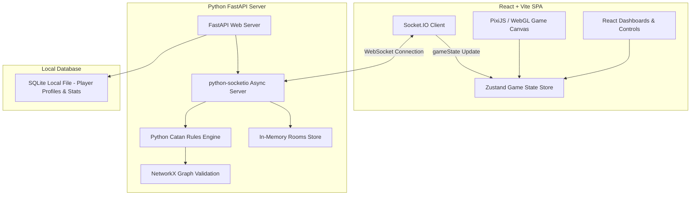

# Catan Lite: Roadmap to a Proper Multiplayer Catan Game 🎲

This document outlines the essential improvements needed to turn the current **Catan Lite** implementation into a proper, fully-compliant Catan game suitable for playing with a group of friends. It covers mechanics, networking, UI/UX, and specific game mode expansions.

---

## 1. Core Gameplay & Rule Compliance (Backend & Logic)

The current implementation lacks several core rules of classic Catan that are crucial for strategic depth.

### 🃏 Development Card Playing System
While players can *buy* development cards, there is currently **no way to play them**.
* **Knight Cards**: Playing a Knight should allow the active player to immediately move the Robber and steal a card from an adjacent player, in addition to incrementing their active knight count for **Largest Army**.
* **Progress Cards**:
  * **Road Building**: Places 2 free roads on the board.
  * **Year of Plenty**: Draws 2 resources of the player's choice from the bank.
  * **Monopoly**: Forces all other players to give the playing player all resource cards of a declared type.
* **Rule Constraints**: Implement the rule that a player cannot play a development card on the turn they bought it (except for Victory Point cards, which remain hidden until victory is claimed).

### 🤝 Player-to-Player (Domestic) Trading
Catan's social highlight is negotiation. Currently, only 4:1 bank trades are supported.
* **Backend Socket Support**: Add a transaction protocol (`proposeTrade`, `acceptTrade`, `counterTrade`, `cancelTrade`, `executeTrade`).
* **Open Trade Pool**: Allow the active player to post an offer (e.g., *"Offering 2 Wood for 1 Ore"*) and allow other players to accept or counter-offer.

### ⚓ Ports & Harbors (Port Trading)
Currently, all bank trades are locked at 4:1. The board is missing ports.
* **Board Generation**: Generate 9 ports around the 19-hex board:
  * Five **2:1 Specialty Ports** (Wood, Brick, Sheep, Wheat, Ore).
  * Four **3:1 Generic Ports**.
* **Trade Logic**: If a player has a settlement or city built on a vertex adjacent to a port, they should unlock 3:1 or 2:1 bank trades for the corresponding resources.

### 🏆 Special Victory Point Cards
Two major swing mechanics in Catan are completely absent:
* **Longest Road**: The first player to reach a continuous road chain of **5 or more segments** receives the Longest Road card (+2 VPs). If another player builds a strictly longer chain, the card transfers.
* **Largest Army**: The first player to play **3 Knight cards** receives the Largest Army card (+2 VPs). If another player plays more Knights, the card transfers.

### 👥 Targeted Stealing (Robber Choice)
When the robber is moved, the server currently steals a resource card from a *random* adjacent player.
* **Proper Rule**: If a hex has settlements belonging to multiple opponents, the player moving the robber must explicitly choose which opponent to steal from.

### 🏗️ Piece Limits (Resource Scarcity)
In standard Catan, players do not have infinite structures.
* **Piece Caps**: Enforce piece limits per player:
  * **5 Settlements**
  * **4 Cities**
  * **15 Roads**
  * **15 Ships** (in Seafarers mode)

---

## 2. Multiplayer & Networking Enhancements

For a group of friends playing online, communication and lobby flow are critical.

### 💬 In-Game Chat Box
* **Feature**: A text chat widget for player-to-player communication (and trade discussions).
* **System Broadcasts**: Integrate the game log into the chat so players can see rolls, trades, and builds alongside player chat messages.

### 🔗 Shareable Room Links
* **Feature**: Add a "Copy Link" button in the lobby that encodes the room code into the URL (e.g., `http://localhost:3000/?room=ABCD`) for instant join.

### 🎨 Lobby Customization & Readiness
* **Feature**:
  * Allow players to choose their own slot/color inside the lobby (currently handled by the host).
  * Implement a "Ready" check for players so the host cannot start the game until everyone is ready.

### 🔄 State Recovery & Disconnect Tolerance
* **Issue**: If a player disconnects during their discard phase or turn, the game can get stuck.
* **Feature**:
  * Auto-pass turns if a player remains disconnected/inactive for a configurable timeout.
  * Robust state synchronization when a player reloads the page.

---

## 3. Frontend & UI/UX Improvements

The UI should feel tactile, alive, and easy to interact with.

### 🖼️ Board Visual Polish
* **Ports Display**: Draw ports on the canvas as small docks or ships extending from coastal vertices, labeled with their trade ratio (e.g., `3:1` or `🌾 2:1`).
* **Visualizing the Robber**: Replace the generic Robber text with a stylized robber token drawn on the canvas (e.g., a dark pawn).
* **Piece Details**: Improve settlement and city drawings, and ensure roads and ships look distinct.

### 🎴 Development Card Management
* **Feature**: Click on a development card in the bottom deck to trigger a play overlay:
  * Knight: Prompts the player to click a hex to move the robber.
  * Year of Plenty: Opens a selector to choose 2 resources.
  * Monopoly: Opens a selector to choose 1 resource.
  * Road Building: Highlights placeable road edges.

### 📊 Interactive Trading Interface
* **Feature**: A dedicated trade panel where the active player can construct an offer and broadcast it:
  * Opponents get a pop-up: `"Player 1 offers 2 Sheep for 1 Ore. [Accept] [Counter] [Decline]"`.

### 🃏 Non-Intrusive Discard UX
* **Issue**: The current discard modal blocks the entire screen.
* **Feature**: Allow players to see the board map behind a semi-transparent drawer while picking cards to discard.

---

## 4. Expansion Modes Refinements

Specific mode improvements to make Seafarers and Hero & Knight feel complete.

### ⛵ Seafarers Mode Refinements
* **Shipping Rules**: Ensure ships can only be placed on water edges and must connect to the player's existing ships or settlements.
* **Moving Ships**: Implement the rule where a player can move their open (unconnected on one end) ship to another valid edge once per turn.
* **Discovery Bonus**: Reward players with 2 bonus VPs when they build their first settlement on a foreign islet.

### 🛡️ Hero & Knight (Cities & Knights Lite)
* **Barbarian Visuals**: Create a progress bar or threat dial on the canvas.
* **Knight Placement**: Instead of Knight Power being a simple stat, represent Knights as active/inactive tokens on the board vertices (like in the actual *Cities & Knights* expansion).

---

## 5. Simplified Technical Stack & Architecture (Small-Scale Group Setup)

For playing Catan with a group of friends, we want to keep infrastructure overhead as low as possible. We do not need heavy cloud servers, distributed caching (Redis), or external databases (PostgreSQL). A lightweight, single-server setup is perfect.

### 🐍 Python Backend (FastAPI + SQLite + In-Memory Rooms)
Rewriting the server logic in Python provides massive advantages for gameplay logic while keeping the infrastructure lightweight:
* **Advanced Graph Algorithms**: Determining the "Longest Road" and checking placement rules is inherently a graph theory problem. Using Python's **NetworkX** library allows you to represent the Catan board vertices and edges as a graph, making cycle checking and path-finding algorithms extremely clean and efficient.
* **Asynchronous WebSockets**: Python's **FastAPI** coupled with `python-socketio` provides an asynchronous event loop that handles WebSocket connections seamlessly on a single free-tier server.
* **Serverless Local Storage (SQLite)**: Instead of setting up a PostgreSQL server, use **SQLite** (a single `.db` file in the project folder). It requires zero configuration, zero cost, and is perfect for saving player profiles, friends lists, win/loss history, and match records for a small group.
* **In-Memory Room Management**: Storing active game room states directly in the python process RAM is clean, fast, and does not require Redis. 
* **AI Bot Intelligence**: You can easily implement heuristics or minimax decision engines in Python to run smarter bots.

### ⚛️ Modern Frontend (React + Vite + PixiJS)
Migrating the monolithic frontend structure allows for modularity, better performance, and standard styling practices:
* **Component-Based Architecture**: Split the client code into reusable, isolated React components (`Lobby`, `BoardCanvas`, `TradePanel`, `ChatWidget`, `PlayerDashboard`).
* **State Management (Zustand)**: Manage real-time state broadcasts from the socket client using Zustand. This prevents unnecessary React re-renders and handles clean state synchronization.
* **High-Performance Canvas (PixiJS)**: Vanilla 2D canvas starts lagging on older devices with many particle animations (like flying cards). Migrating the board rendering to **PixiJS (WebGL)** provides hardware-accelerated rendering, smooth zoom, pan, and advanced animations.
* **Styling & Theme (TailwindCSS)**: Introduce TailwindCSS to build a modern, responsive, glassmorphic layout. This easily supports dark/light mode toggles and modern dashboard aesthetics.

